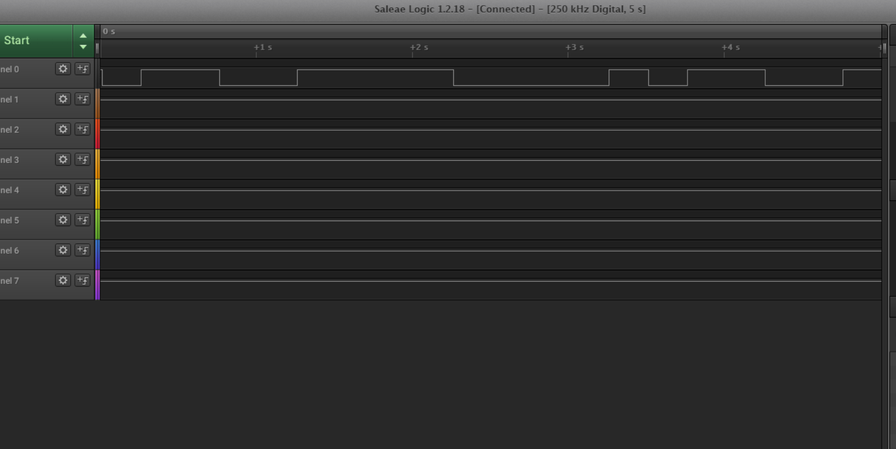
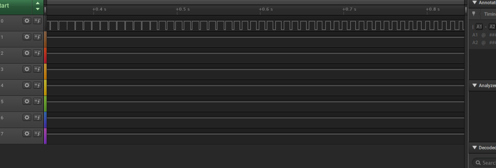
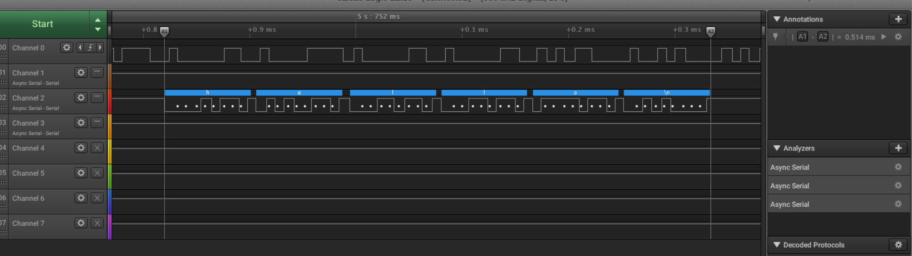
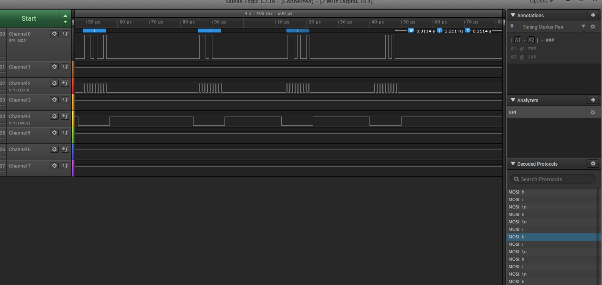

Name: Hayden Pietsch

EID: HSP528

Team Number: 14

## Questions

1. Why does your program need a setup and a loop?

    To define variables in setup, and run program in loop

2. What is the downside to putting all your code in a loop?

    It will redefine variables and run all code each time, better to call functions
3. Why does your code need to be compiled?

    To convert code from High level language to machine code

4. When lowering the frequency in procedure A, step 4, what is going wrong? Brainstorm some solutions. Dimmers exist in the real world. What is their solution?

   Your eye can only see a certain frequency until it looks like its always off or on. increase the duty cycle.

5. Why do you need to connect the logic analyzer ground to the ESP32 ground?

   Voltage is relative, need this so it won't float

6. What is the difference between synchronous and asynchronous communication?
    synchronous is on a clock, asynch is not
    

7. Profile of UART: Sent X bytes in Y time 

    6bytes in .514ms

8. Profile of SPI: Sent X bytes in Y time

  2bytes in 35.5 microseconds

9. Why is SPI so much faster than UART?

   SPI is Synchronous

10. list one pro and one con of UART

    pro: less wires Con: slower

11. list one pro and one con of SPI

   Pro: faster Con: more wires

12. list one pro and one con of I2C

   pro: simple addressing Con: complex hardware

13. Why does I2C need external resistors to work?

    lines need pullup or pull down resistors

## Screenshots

Procedure A, step 1:

Procedure A, step 4:

Procedure B, UART:

Procedure B, SPI:

